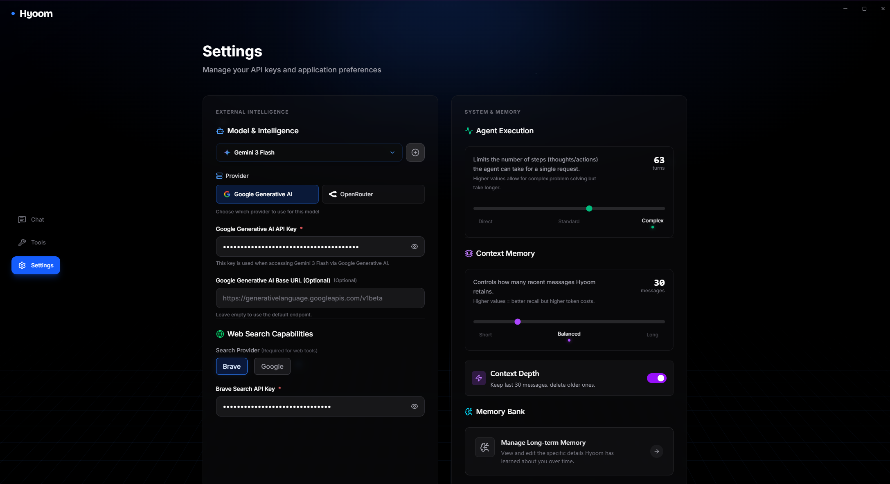
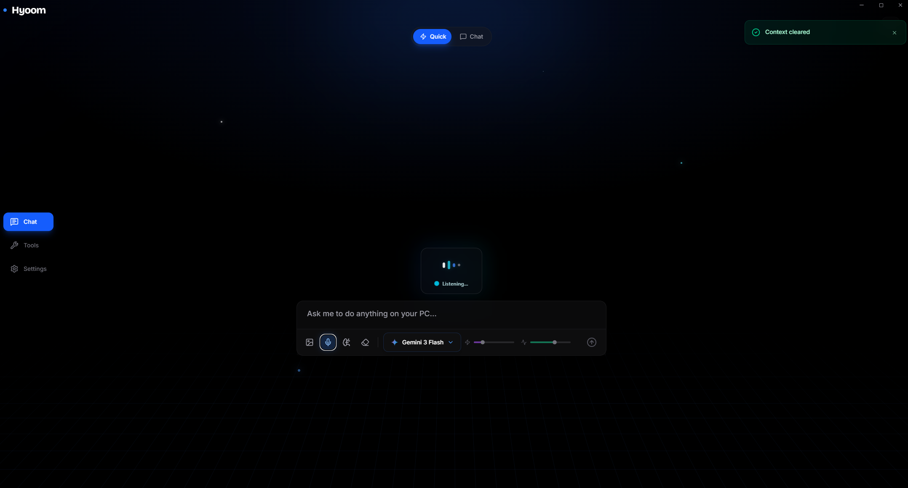

# Hyoom 🚀

> A voice-controlled AI desktop assistant that writes code to automate your computer.


## What is Hyoom?

Hyoom is an AI agent that controls your desktop through natural language. Instead of using predefined commands, it **dynamically discovers tools** using semantic search and **writes TypeScript code** to execute tasks.

**Example:**
- You: "Hey Hyoom, create a folder called Projects on my desktop"
- Hyoom: *searches for filesystem tools → reads createFolder.ts → writes code → executes*
- Result: Folder created

## Key Features

🎯 **Semantic Tool Discovery**
- Uses embeddings to find the right tools for any task
- No need to memorize commands - just ask naturally

🧠 **Memory System**
- Remembers your preferences (music player, file locations, etc.)
- Learns from past interactions

🎙️ **Voice Activation**
- "Hey Hyoom" wake word detection (100ms response time)
- Fully offline speech recognition

⚙️ **Maximum Customization**
- Bring your own API key (OpenAI, Anthropic, Google, Groq)
- Local LLM support (Ollama, LM Studio)
- Adjustable context window (10-60 messages)
- Optional context compression for long conversations

🔧 **Extensible Architecture**
- 30+ built-in tools (filesystem, web, system control)
- Easy to add custom tools (just write TypeScript)

## Tech Stack

- **Frontend:** React + TypeScript + Tailwind
- **Backend:** Tauri (Rust)
- **AI Runtime:** Deno (sandboxed code execution)
- **Voice:** Whisper.rs + Vosk
- **Embeddings:** sentence-transformers (all-MiniLM-L6-v2)

## How It Works

1. **You speak or type a command**
2. **Hyoom searches** for relevant tools using semantic similarity
3. **Reads tool source code** to understand parameters/behavior
4. **Generates TypeScript code** that calls those tools
5. **Executes in Deno sandbox** with limited permissions
6. **Returns result** to you

## Screenshots


*Multi-provider LLM support with local model integration*


*AI remembers your preferences across sessions*


*Real-time transcription with wake word detection*

## Installation

**Requirements:**
- Windows 10/11 (macOS/Linux support coming soon)
- Node.js 18+
- Deno 2.0+

**Download:**
[Latest Release](https://github.com/Ddavid1785/hyoom/releases)

Or build from source:
```bash
git clone https://github.com/Ddavid1785/hyoom
cd hyoom
bun install
bun run tauri build
```

## Usage

1. Launch Hyoom
2. Set up your LLM provider (API key or local model)
3. Start with voice: "Hey Hyoom, what can you do?"
4. Or type commands in the chat interface

**Example commands:**
- "Screenshot my screen and save to desktop"
- "Search the web for Rust tutorials and open the first result"
- "Create a folder called Work in my Documents"
- "What's the weather today?"

## Adding Custom Tools

Create a new file in `deno-backend/Tools/`:
```typescript
// Tools/MyCategory/myTool.ts

export interface MyToolParams {
  input: string;
}

export interface MyToolResult {
  success: boolean;
  output: string;
}

/**
 * Description of what this tool does.
 * Be specific - the AI uses this to decide when to call it.
 */
export async function myTool(params: MyToolParams): Promise {
  // Your implementation
  return { success: true, output: "Done!" };
}
```

Restart Hyoom - the tool is automatically discovered via semantic search.

## Roadmap

- [ ] ESP32 integration for IoT control
- [ ] Mobile app (send commands from phone)
- [ ] Vector DB for all tools (can download all the vectorized tools from it)

## Why I Built This

I wanted an AI assistant that:
1. Runs locally (privacy-first)
2. Actually understands what I'm asking (semantic search)
3. Can do ANYTHING on my computer (code generation)
4. Learns my preferences (memory system)

Most AI assistants are cloud-only, limited to predefined commands, and don't remember you. Hyoom solves all three.

## License

MIT

## Acknowledgments

Built in 2 months as a high school project. Inspired by Anthropic's research on agentic workflows and code execution.

---

**Star ⭐ this repo if you find it useful!**
